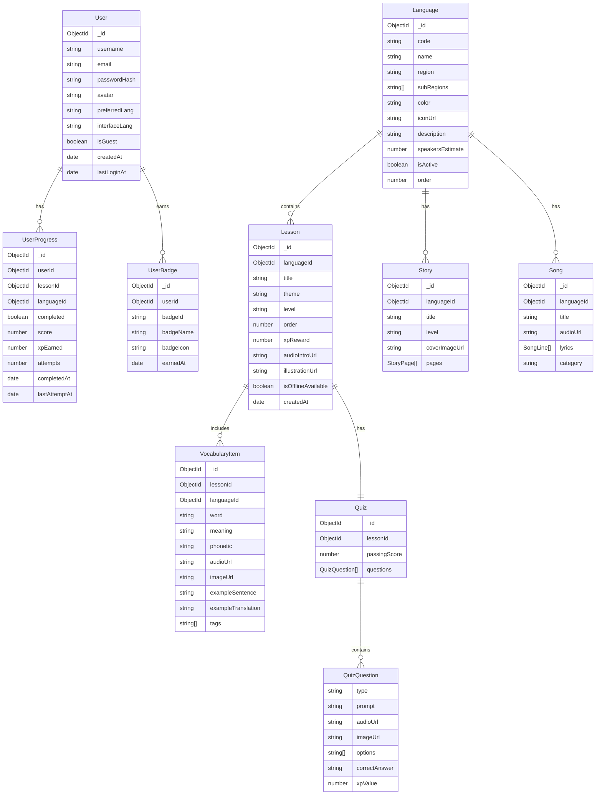

# 🗄️ Schéma de Base de Données — Lingua-Cam (MongoDB Atlas)

> **ODM :** Mongoose  
> **DB :** MongoDB Atlas (NoSQL)  
> **Version :** 1.0

---

## Vue d'ensemble des Collections



---

## Détail des Schémas Mongoose

### 1. `User`
```typescript
{
  _id: ObjectId,
  username: { type: String, required: true, unique: true, trim: true },
  email: { type: String, unique: true, sparse: true, lowercase: true },
  passwordHash: { type: String }, // null si guest
  avatar: { type: String, default: 'default_avatar' },
  preferredLanguageId: { type: ObjectId, ref: 'Language' },
  interfaceLang: { type: String, enum: ['fr', 'en'], default: 'fr' },
  isGuest: { type: Boolean, default: false },
  streak: { type: Number, default: 0 },
  lastStreakDate: { type: Date },
  totalXp: { type: Number, default: 0 },
  level: { type: String, default: 'novice' },
  refreshTokenHash: { type: String }, // pour invalidation
  createdAt: { type: Date, default: Date.now },
  updatedAt: { type: Date, default: Date.now }
}
```

### 2. `Language`
```typescript
{
  _id: ObjectId,
  code: { type: String, required: true, unique: true }, // 'ewondo', 'bassa'
  name: { type: String, required: true },
  region: { type: String, required: true },
  subRegions: [String],
  color: { type: String, default: '#007A5E' },       // couleur carte
  gradientColors: [String],
  iconUrl: { type: String },
  mapCoordinates: { lat: Number, lng: Number },
  description: { type: String },
  speakersEstimate: { type: Number },
  phase: { type: Number, enum: [1, 2, 3], default: 1 },
  isActive: { type: Boolean, default: false },
  order: { type: Number }
}
```

### 3. `Lesson`
```typescript
{
  _id: ObjectId,
  languageId: { type: ObjectId, ref: 'Language', required: true },
  title: { type: String, required: true },
  theme: { type: String, required: true },  // 'salutations', 'famille'...
  level: { type: String, enum: ['beginner', 'intermediate', 'advanced'] },
  order: { type: Number, required: true },
  xpReward: { type: Number, default: 50 },
  estimatedMinutes: { type: Number, default: 10 },
  audioIntroUrl: { type: String },
  illustrationUrl: { type: String },
  isOfflineAvailable: { type: Boolean, default: false },
  isPublished: { type: Boolean, default: false },
  createdAt: { type: Date, default: Date.now }
}
```

### 4. `VocabularyItem`
```typescript
{
  _id: ObjectId,
  lessonId: { type: ObjectId, ref: 'Lesson', required: true },
  languageId: { type: ObjectId, ref: 'Language', required: true },
  word: { type: String, required: true },          // mot en langue locale
  meaning: { type: String, required: true },        // traduction française
  meaningEn: { type: String },                      // traduction anglaise
  phonetic: { type: String },                       // transcription IPA
  audioUrl: { type: String },                       // Cloudinary URL
  imageUrl: { type: String },
  exampleSentence: { type: String },
  exampleTranslation: { type: String },
  tags: [String],                                   // ['salutation', 'formel']
  difficultyLevel: { type: Number, min: 1, max: 5, default: 1 },
  validatedByNative: { type: Boolean, default: false }
}
```

### 5. `Quiz`
```typescript
{
  _id: ObjectId,
  lessonId: { type: ObjectId, ref: 'Lesson', required: true, unique: true },
  passingScore: { type: Number, default: 70 },  // pourcentage
  questions: [{
    type: { 
      type: String, 
      enum: ['mcq_audio', 'mcq_image', 'drag_drop', 'fill_blank', 'voice', 'order', 'memory']
    },
    prompt: String,
    audioUrl: String,
    imageUrl: String,
    options: [String],
    correctAnswer: String,
    xpValue: { type: Number, default: 10 }
  }]
}
```

### 6. `UserProgress`
```typescript
{
  _id: ObjectId,
  userId: { type: ObjectId, ref: 'User', required: true },
  lessonId: { type: ObjectId, ref: 'Lesson', required: true },
  languageId: { type: ObjectId, ref: 'Language', required: true },
  completed: { type: Boolean, default: false },
  score: { type: Number, default: 0 },           // 0-100
  xpEarned: { type: Number, default: 0 },
  attempts: { type: Number, default: 0 },
  completedAt: { type: Date },
  lastAttemptAt: { type: Date, default: Date.now },
  // index composé: userId + lessonId = unique
}
// Index: { userId: 1, lessonId: 1 }, unique: true
```

### 7. `Story`
```typescript
{
  _id: ObjectId,
  languageId: { type: ObjectId, ref: 'Language', required: true },
  title: { type: String, required: true },
  titleFr: { type: String },
  level: { type: String, enum: ['beginner', 'intermediate', 'advanced'] },
  coverImageUrl: { type: String },
  pages: [{
    pageNumber: Number,
    text: String,           // texte en langue locale
    textFr: String,         // traduction française
    imageUrl: String,
    audioUrl: String,
    audioDurationMs: Number
  }],
  totalPages: { type: Number },
  isPublished: { type: Boolean, default: false }
}
```

### 8. `Song`
```typescript
{
  _id: ObjectId,
  languageId: { type: ObjectId, ref: 'Language', required: true },
  title: { type: String, required: true },
  titleFr: { type: String },
  audioUrl: { type: String, required: true },
  coverImageUrl: { type: String },
  category: { type: String, enum: ['traditional', 'children', 'modern'] },
  lyrics: [{
    lineNumber: Number,
    text: String,            // paroles en langue locale
    textFr: String,
    startTimeMs: Number,     // pour le karaoké sync
    endTimeMs: Number
  }],
  isPublished: { type: Boolean, default: false }
}
```

---

## Indexes MongoDB recommandés

```javascript
// UserProgress
db.userprogresses.createIndex({ userId: 1, lessonId: 1 }, { unique: true })
db.userprogresses.createIndex({ userId: 1, languageId: 1 })

// VocabularyItem
db.vocabularyitems.createIndex({ lessonId: 1 })
db.vocabularyitems.createIndex({ languageId: 1 })
db.vocabularyitems.createIndex({ word: 'text', meaning: 'text' }) // text search

// Lesson
db.lessons.createIndex({ languageId: 1, order: 1 })
db.lessons.createIndex({ languageId: 1, isPublished: 1 })

// User
db.users.createIndex({ email: 1 }, { sparse: true })
db.users.createIndex({ username: 1 })
```

---

*Dernière mise à jour : Avril 2026*
